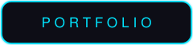
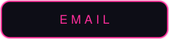

<!--
  Profile landing page. Intentionally minimal.
  Banner + buttons are self-hosted animated SVGs in /assets (no external services).
  To tweak the art (palette, wave count, name), edit assets/generate_header.py and run:
      python3 assets/generate_header.py
-->

 

&nbsp;&nbsp;

